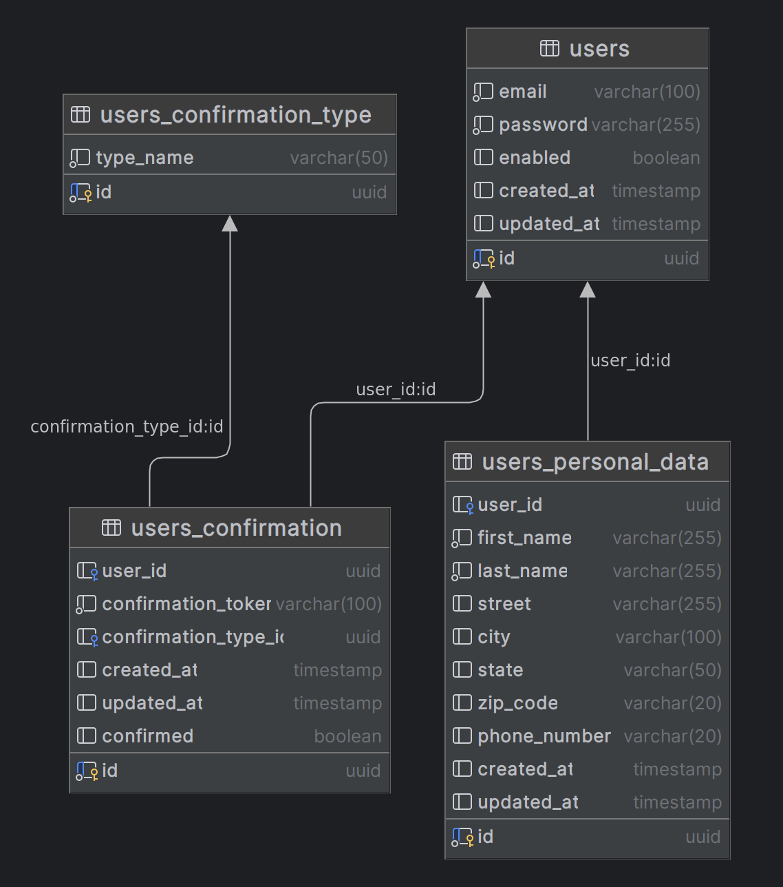

# User Database

## When should I use this database?

- I want to create new users and verify their email
- I want to register users' personal data
- I want to manage my users' data
- I want to allow users to change email and password, confirming the change

## How to start up the database?

Open your terminal and run this command in the root of the project and be happy :smile:

```console
docker-compose up
```

## How to shut down the database?

Open your terminal and run this command in the root of the project and go get a coffee :coffee:

```console
docker-compose down
```
## How to change the database structure?

Write a new migration in the `db/migration` folder

## Services that consume this database
- [ms-register-user]()

## Diagram
